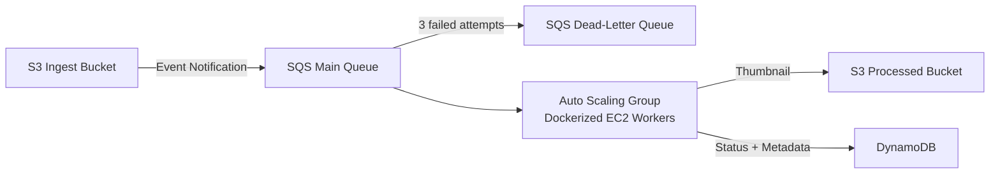

# Resilient Event-Driven Image Processing Platform

A production-style, event-driven image processing pipeline built on AWS — using **Docker on plain EC2 Auto Scaling Groups** (deliberately without ECS/Fargate/Kubernetes) to demonstrate a deep understanding of what container orchestration platforms typically abstract away.

## Architecture



**Flow:** An image uploaded to the ingest bucket triggers an S3 Event Notification, which places a message on an SQS queue. Auto Scaling EC2 instances running Dockerized Python workers poll the queue, download the image, generate a thumbnail, extract metadata, write the result to a processed bucket and DynamoDB, then delete the message. Messages that fail repeatedly are routed to a Dead-Letter Queue for investigation.

## Why Docker on plain EC2 (not ECS/Fargate)?

This project intentionally avoids managed container orchestration to build a first-principles understanding of:
- How EC2 Auto Scaling integrates with containerized workloads
- How instances self-configure at launch (via User Data) to pull and run an approved image from ECR
- How IAM roles, container runtime, and cloud-native permissions interact without an orchestration layer doing it for you

## Key practices

**Docker & ECR**
- Multi-stage Dockerfile — separate build and runtime stages, minimal final image
- Non-root container user
- Immutable image tags on Amazon ECR (no `latest` in production)
- Image scanning on push (ECR) + local Trivy scans before every push
- Auto Scaling instances pull the approved image automatically via User Data — no manual deployment step

**Security**
- No SSH, no key pairs — access exclusively via AWS Systems Manager Session Manager
- IMDSv2 enforced on all instances
- Least-privilege IAM roles, scoped per resource (ECR pull-only, S3 read/write split by bucket, DynamoDB limited to specific actions)
- Encrypted EBS volumes, encrypted S3/SQS/DynamoDB at rest
- TLS-only S3 bucket policies, full Block Public Access

**Resilience**
- Dead-letter queue with configurable max receive count
- Multi-AZ Auto Scaling Group for automatic failure recovery
- DynamoDB point-in-time recovery
- S3 versioning on both buckets

## Tech stack

- **Compute:** EC2 (Amazon Linux 2023, t3.micro), Auto Scaling Groups
- **Containers:** Docker, Amazon ECR
- **Messaging:** Amazon SQS (Standard queue + DLQ)
- **Storage:** Amazon S3, Amazon DynamoDB
- **Application:** Python, boto3, Pillow
- **Networking:** VPC across 2 AZs, private subnets for workers, S3/DynamoDB Gateway Endpoints

## Project structure

```
worker/
├── worker.py          # SQS polling, image processing, S3/DynamoDB writes
├── Dockerfile          # Multi-stage build, non-root runtime
├── requirements.txt    # boto3, Pillow
├── test_local.py       # Local unit tests (no AWS dependency)
└── .dockerignore
```

